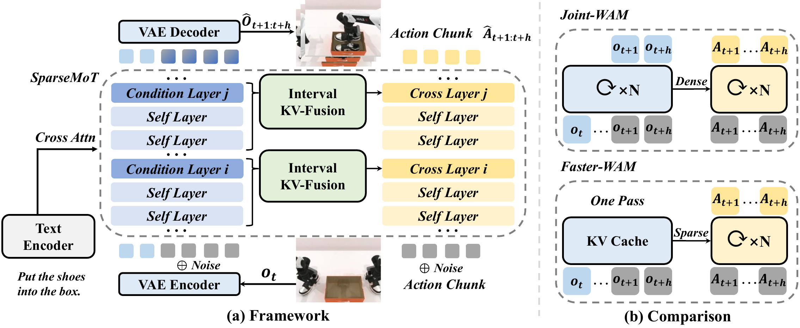

<h2><nobr>Faster-WAM: Efficient Inference-Time Future Conditioning</nobr> <nobr>for Robust World Action Models</nobr></h2>

<b>Weiheng Zhao</b>1 &middot; <b>Haoyi Jiang</b>1 &middot; <b>Xin Shi</b>2 &middot; <b>Liu Liu</b>3 &middot; <b>Zhizhong Su</b>3 &middot; <b>Wei Sui</b>2 &middot; <b>Fan Huang</b>4 &middot; <b>Xinggang Wang</b>1

Huazhong University of Science and Technology1 &middot; D-Robotics2 &middot; Horizon Robotics3 &middot; Xiamen University4

The key insight behind **Faster-WAM** is that future representations are not merely an auxiliary training signal, but essential inference-time context for robust action prediction under distribution shifts. Guided by this principle, Faster-WAM computes future representations once and selectively reuses them during action denoising, reducing redundant video-action interaction. It achieves state-of-the-art in-distribution performance and robust OOD generalization across simulated and real-world manipulation, while substantially reducing inference latency.

  

---

## Table of Contents

- [Release](#release)

## Release

- [ ] Training and inference code
- [ ] Model checkpoints
